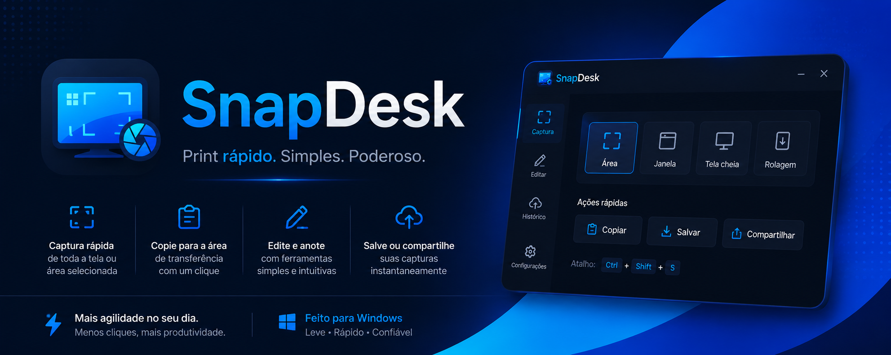

<p align="center">
  
</p>

<h1 align="center">🚀 SnapDesk</h1>

<p align="center">
  Lightweight screenshot tool for Windows focused on speed, OCR and instant sharing.
</p>

<p align="center">


</p>

---

# ✨ About

SnapDesk is a lightweight and modern screenshot tool for Windows designed to make screen capturing faster, cleaner and more productive.

Capture screenshots instantly, extract text with OCR, edit images in a floating overlay editor and upload/share everything in seconds.

Inspired by tools like Lightshot, but built with a cleaner workflow and powerful native features.

---

# ⚡ Features

✅ Global screenshot hotkeys  
✅ Frozen screen area selection  
✅ Floating editor overlay  
✅ Offline OCR extraction  
✅ Clipboard integration  
✅ Instant cloud uploads  
✅ Discord webhook uploads  
✅ Lightweight native performance  
✅ Tray icon background app  
✅ Portable version + installer  

---

# 📸 Screenshots

## 🖥 Main Interface

<p align="center">
  
</p>

---

## ✂️ Area Capture

<p align="center">
  
</p>

---

## 🧠 OCR Extraction

<p align="center">
  
</p>

---

## ☁️ Upload System

<p align="center">
  
</p>

---

# 🚀 Workflow

```txt
Press Hotkey
   ↓
Freeze Screen
   ↓
Select Area
   ↓
Edit / OCR / Upload
   ↓
Copy & Share Instantly
```

---

# ⌨️ Default Hotkeys

| Action | Shortcut |
|---|---|
| 📸 Screenshot | `Ctrl + Shift + S` |
| 🧠 OCR | `Ctrl + Shift + T` |
| ❌ Cancel Selection | `Esc` |

---

# 🛠 Editor Tools

SnapDesk includes a floating editor with:

- ➜ Arrow Tool
- 🟦 Blur
- ✨ Highlight
- 🧩 Pixelate
- 🔢 Number Markers
- 📝 Inline Text
- 🎨 Color Markers
- ↩ Undo (`Ctrl + Z`)
- 📋 Copy Image (`Ctrl + C`)
- ❌ Delete Selection

---

# 🧠 OCR System

SnapDesk supports fast offline OCR using native Windows OCR APIs.

### Features

- ⚡ Instant text extraction
- 📋 Automatic clipboard copy
- 🌎 Multi-language support
- 🧾 OCR preview popup
- 🗂 OCR history
- 🔒 Fully offline OCR

---

# ☁️ Upload Providers

## 📤 Temporary Uploads

Powered by Litterbox/Catbox.

### Includes

- Public temporary links
- Automatic clipboard copy
- Upload progress
- Upload cancellation
- Local rate limiting

---

## 💬 Discord Uploads

Upload screenshots directly to Discord channels using webhooks.

Perfect for:
- Teams
- Developers
- Fast sharing
- Gaming communities

---

# 🧱 Tech Stack

| Technology | Usage |
|---|---|
| C# | Core App |
| Windows Forms | Desktop UI |
| .NET | Runtime |
| WinRT OCR | OCR Engine |
| HttpClient | Upload System |
| System.Drawing | Image Processing |

---

# 📂 Project Structure

```txt
src-native/
 ├── Services/
 │   ├── OCR/
 │   └── Upload/
 │
 ├── SnapDesk.cs
 └── SnapDeskInstaller.cs
```

---

# 📦 Builds

## 🖥 Portable Version

```txt
dist/portable/SnapDesk.exe
```

## 📥 Installer

```txt
dist/installer/SnapDeskSetup.exe
```

## 📦 Portable ZIP

```txt
dist/installer/SnapDeskPortable.zip
```

---

# 🗺 Roadmap

## ✅ v0.2
- OCR
- Upload System
- Floating Editor
- Tray App
- Installer
- Hotkeys

---

## 🔜 v0.3
- Better Editor Polish
- Local Screenshot History
- Improved Settings UI
- Better Upload Feedback

---

## 🚀 Future Plans

- 🌐 Own SnapDesk API
- 👤 User Accounts
- ☁️ Private Uploads
- 🎥 Screen Recording
- 🔄 Auto Updates
- 📁 Cloud Integrations
- 🧠 AI OCR Improvements

---

# 🖼 Branding

<p align="center">
  
</p>

---

# 💻 Official Website

🌐 https://italozkv.github.io/snapdesk_website/

---

# 📌 Current Status

```txt
Active Prototype Development
```

SnapDesk is currently under active development and evolving into a complete lightweight productivity tool for Windows.

---

# ❤️ Philosophy

SnapDesk was built with one goal:

> Make screenshots fast, clean and effortless.

No bloated UI.  
No unnecessary complexity.  
Just speed, productivity and simplicity.

---

# 📜 License

This project is currently prototype/private software.

---

<p align="center">
  Made with ❤️ using C# and Windows native technologies.
</p>
